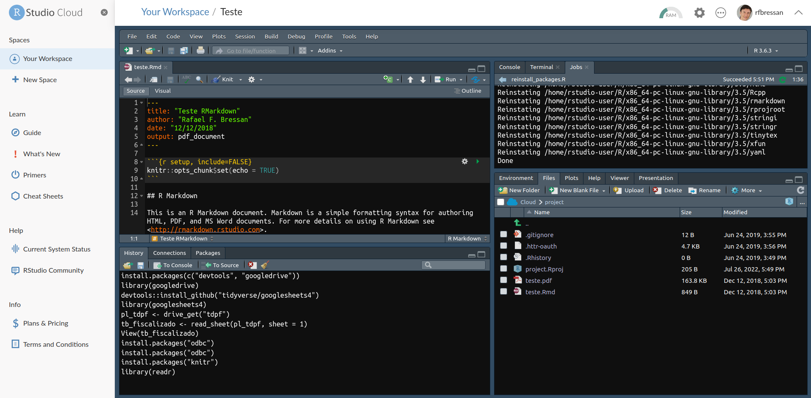

layout: true

<div class="my-footer"></div> 

---

```{r setup, include = FALSE, warning = FALSE, message = FALSE}
options(htmltools.dir.version = FALSE)
knitr::opts_chunk$set(
  message = FALSE,
  warning = FALSE,
  dev = "svg",
  cache = TRUE,
  fig.align = "center"
  #fig.width = 11,
  #fig.height = 5
)

# Load packages
library(tidyverse)
library(pander)
library(ggthemes)
library(gapminder)
library(xaringanExtra)
```

```{r xaringan-panelset, echo=FALSE}
xaringanExtra::use_panelset()
```

# Bem-vindos a Econometria I!

--

- Neste curso você aprenderá as principais ferramentas de ***econometria***.
 
--

- Você também aprenderá a usar a linguagem de programação `R`!

--

## O que é *econometria*?

- Um conjunto de ***técnicas e métodos*** para responder questões (econômicas) com ***dados***.

- Alguns exemplos!

---

# Respondendo a perguntas importantes com econometria

[<ru-blockquote>
A imigração *leva* a salários mais baixos e/ou desemprego mais alto para os habitantes locais?
</ru-blockquote>](http://davidcard.berkeley.edu/papers/mariel-impact.pdf)

--

[<ru-blockquote>
Aumentar o salário mínimo *reduz* o emprego para os menos qualificados?
</ru-blockquote>](http://davidcard.berkeley.edu/papers/njmin-aer.pdf)

--

[<ru-blockquote>
Obter um diploma universitário * oferece * salários mais altos?
</ru-blockquote>](http://davidcard.berkeley.edu/papers/causal_educ_earnings.pdf)

--

[<ru-blockquote>
Níveis mais altos de dívida pública *levam* a um menor crescimento econômico?
</ru-blockquote>](https://www.imf.org/external/pubs/ft/wp/2014/wp1434.pdf)

--

[<ru-blockquote>
O bairro em que você cresceu tem um *impacto* nos resultados de sua vida?
</ru-blockquote>](https://academic.oup.com/qje/article/133/3/1107/4850660)


<!-- # Causality -->

<!-- * Notice that ***many other factors could have caused*** each of the outcomes mentioned. -->

<!-- -- -->

<!-- * Want to focus on ***causal impact*** of just one of these factors (immigration, minimum wage, education ,etc.) -->

<!-- -- -->

<!-- * Econometrics is often about spelling out ***conditions*** under which we can ***claim to measure causal relationships***. -->

<!-- * We will encounter the most basic of those conditions, and talk about some potential pitfalls. -->

<!-- * ["Credibility Revolution"](https://www.aeaweb.org/articles?id=10.1257/jep.24.2.3) in econometrics over the past 30 years ([2022 Economics Nobel](https://www.nobelprize.org/prizes/economic-sciences/2021/press-release/) awarded to some of the main protagonists of this "revolution") -->

---

layout: false
class: clear, center, middle

background-image: url(../img/covers/r-programming.jpeg)
background-size: cover

---

layout: true

<div class="my-footer"></div> 

---

## O que é o `R`?

`R` é uma __linguagem de programação__ com poderosos recursos estatísticos e gráficos.

--

## Por que vamos usar `R`?<sup>1</sup>

.footnote[
[1]: Esta lista foi inspirada por [Ed Rubin's](https://github.com/edrubin/EC421S19).
<span style="visibility:hidden">[2]: Aprender `R` definitivamente requer tempo e esforço, mas vale a pena, confie em mim! `r emo::ji("muscle")`.</span>
]

--

1. `R` é __gratuito__ e __open source__— salvando você e a universidade 💰💵💰.

--

1. O `R` é muito __flexível e poderoso__—adaptável a praticamente qualquer tarefa (limpeza de dados, visualização de dados, econometria, análise de dados espaciais, aprendizado de máquina, web scraping, etc.)

--

1. O `R` tem uma vibrante [comunidade online](https://stackoverflow.com/questions/tagged/r) que (quase) sempre terá uma solução para o seu problema.

--

1. Se você se esforçar<sup>2</sup>, sairá com uma ferramenta __muito valiosa e útil__.

.footnote[
<span style="visibility:hidden">[1]: sta lista foi inspirada por [Ed Rubin's](https://github.com/edrubin/EC421S19).</span>  
[2]: Aprender `R` definitivamente requer tempo e esforço, mas vale a pena, acreditem! `r emo::ji("muscle")`
]

<!-- --- -->

<!-- # Why can't we just use Excel? -->

<!-- Many reasons but here are just a few: -->

<!-- -- -->

<!-- - Not ***reproducible***. -->

<!-- -- -->

<!-- - Not straightforward to ***merge*** datasets together. -->

<!-- -- -->

<!-- - Very fastidious to ***clean*** data. -->

<!-- -- -->

<!-- - Limited to ***small datasets***. -->

<!-- -- -->

<!-- - Not designed for proper ***econometric analyses***, maps, complex visualisations, etc. -->

---

layout: false
class: title-slide-section-grey, middle

# Primeiro Contato com o R 

---

layout: true

<div class="my-footer"></div>

---

# Na Prática: Manipulando Dados

--

* Você gastará muito tempo preparando dados para análise posterior.

--

* O conjunto de dados `gapminder` contém dados sobre expectativa de vida, PIB per capita e população por país entre 1952 e 2007.

* Suponha que queremos saber a expectativa média de vida e o PIB médio per capita para cada continente em cada ano.

--

* Precisamos agrupar os dados por continente *e* ano e, em seguida, calcular a expectativa média de vida e o PIB médio per capita
--

.pull-left[
```{r, gapminder, echo = T, eval = F}
# load gapminder package
library(gapminder)
# load the dataset from the gapminder package
data(gapminder, package = "gapminder") 
# display variables in the dataset
names(gapminder)
# show first 4 lines of this dataframe
head(gapminder,n = 4)
```
]

.pull-right[
```{r, gapminder, echo = F, eval = T}
```
]

---

# Na Prática: Manipulando Dados

* Há sempre várias maneiras de atingir um objetivo. (Como na vida `r emo::ji("smile")`)

* Aqui vamos focar apenas no jeito `tidyverse`:

```{r}
# compute the required statistics
gapminder_dplyr <- gapminder %>% 
  group_by(continent, year) %>% 
  summarise(count = n(),
            mean_lifeexp = mean(lifeExp),
            mean_gdppercap = mean(gdpPercap))
```

```{r}
# show first 5 lines of the new data
head(gapminder_dplyr, n = 5)
```

---

# Visualização

.pull-left[
* Agora podemos *olhar* o resultado em `gapminder_dplyr`, ou calcular algumas estatísticas a partir dele.

* Nada supera uma figura, no entanto:

```{r gampminder_plot, eval = FALSE}
ggplot(data = gapminder_dplyr, 
       mapping = aes(x = mean_lifeexp,
                     y = mean_gdppercap,
                     color = continent,
                     size = count)) +
  geom_point(alpha = 1/3) +
  labs(x = "Expectativa de vida média",
       y = "PIB per capita médio",
       color = "Continente",
       size = "Núm. de países")
```
]

.pull-right[
```{r gampminder_plot, echo = FALSE}
```
]


---

layout: false
class: title-slide-section-grey, middle

# R 101: Aqui é onde você começa

---

layout: true

<div class="my-footer"></div> 

---

# Inicie o `RStudio`!

## Glossário de Termos

* [`R`](https://cran.r-project.org/): é uma linguagem de programação

* [`RStudio`](https://www.rstudio.com/): é um ambiente integrado de desenvolvimento (IDE) para se trabalhar com o `R`.

--

* *comando*: entrada do usuário (texto ou números) que o `R` *entende*.

* *script*: uma lista de comandos colados em um arquivo de texto, cada um separado por uma nova linha, para serem executados um após o outro.

--

* Para executar um script, você precisa destacar as linhas de código relevantes e pressionar `Ctrl`+`Enter` (Windows) ou `Cmd`+`Enter` (Mac).
---

# `RStudio` Layout

```{r, echo = F, out.width = "600px"}
knitr::include_graphics("chapter_intro_files/figure-html/rstudio.png")
```

---

# RStudio Cloud

* A empresa RStudio PBC oferece um serviço de hospedagem em nuvem, chamado [RStudio Cloud](https://rstudio.cloud/), da IDE RStudio

* Existe um plano gratuito para uso (limite de 1GB de RAM e 1 CPU por projeto)

* Pode ser uma boa opção para quem não deseja instalar localmente a IDE

---

# RStudio Cloud

```{r , out.width="800px", echo=FALSE}

```

---

# R como calculadora

* Você pode usar o console `R` como uma calculadora

* Basta digitar uma operação aritmética após `>` e pressionar `Enter`!

--

* Alguma aritmética básica primeiro:
```{r}
4 + 1
8/2
```

* Excelente! O que dizer disso?
```{r}
2^3
# a propósito: isso é um comentário! R, portanto, desconsidera
```

---

# Onde Conseguir Ajuda?

.pull-left[
`R` built-in `help`:
```{r, eval = FALSE}
?log #? in front of function
help(lm)   # help() is equivalent
??plot  # get all help on keyword "plot"
```
]

--

.pull-right[
Na prática<sup>1</sup>:

]

.footnote[
[1]: O passo 4 é clicar no link do [](https://stackoverflow.com/)
]
---

# Pacotes no `R`

* Usuários do `R` contribuem com dados e funções complementares como *pacotes*

* Instalar pacotes é fácil! Basta usar a função `install.packages`:
     ```{r, eval = FALSE}
     install.packages("ggplot2") # NÃO execute este código
     ```

* Para *usar* o conteúdo de um pacote, devemos carregá-lo de nossa biblioteca usando `library`:
     ```{r, message = FALSE, warningn = FALSE, eval = FALSE}
     library(ggplot2)
     ```
---

# Vetores

* A função `c()` cria vetores, ou seja, um array de elementos.
     ```{r}
     c(1, 3, 5, 7, 8, 9)
     ```
    
--

* Coerção a tipos únicos:
     ```{r}
     c(42, "Estatísticas", TRUE)
     ```

--

* Criando um *intervalo*
     ```{r}
     1:10
     ```

---

# `data.frame`s

`data.frame`s são como planilhas.

```{r}
example_data = data.frame(x = c(1, 3, 5, 7),
                          y = c(rep("Olá", 3), "Adeus"),
                          z = c("um", 2, "três", 4))
example_data
```

Na prática, você estará importando arquivos que contêm os dados para o `R` em vez de criar `data.frame`s manualmente.


---

# `data.frame`s

```{r, echo=F}
murders <- read.csv("https://www.dropbox.com/s/zuk0qcfm3kyzs4e/gun_murders.csv?dl=1")
```

Funções úteis para descrever um dataframe:
```{r}
str(murders) # descreve o data.frame
```

--

```{r}
names(murders) # nomes de colunas
```

--

```{r}
nrow(murders) # número de linhas
```

--

```{r}
ncol(murders) # número de colunas
```

---

# Dados sobre assassinatos com armas de fogo nos EUA
    
* Para acessar uma das variáveis **como vetor** usamos o operador `$` como em `murders$state`.
     ```{r}
     murders$state
     ```

---

# Dados sobre assassinatos com armas de fogo nos EUA


.pull-left[
* Podemos verificar o tipo de `murders$state` com
     ```{r}
     class(murders$state)
     ```
]

--

.pull-right[
* Ou usamos o nome da coluna ou índice: `murders[,"state"]` ou `murders[,1]`
     ```{r}
     class(murders[,"state"])
     ```
]

---

# _Subsetting_ `data.frames`

* _Subsetting_ um data.frame: `murders[row condition, column number]` ou `murders[row condition, "column name"]`
    ```{r}
    # Mantenha apenas os estados com mais de 500 assassinatos com armas de fogo e mantenha apenas as variáveis "state" e "total"
    murders[murders$total > 500, c("state", "total")]
    
    # Mantenha apenas a California e o Texas e mantenha apenas as variáveis "state" e "total"
    murders[murders$state %in% c("California", "Texas"), c("state", "total")]
    ```

---


layout: false
class: title-slide-section-grey, middle

# Detalhes sobre as Aulas

---

layout: true

<div class="my-footer"></div> 

---

# Este Curso

- Ensina o básico de ***regressão linear simples e múltipla***, ***inferência estatística*** e ***teste de hipóteses***.

--

- Apresentá-lo ao ambiente de software `R`.

--

- `r emo::ji("warning")` Este *não* é um curso sobre `R`.

--

## Avaliação

1. Haverão ***seis listas de exercícios*** no Teams, aproximadamente uma a cada duas semanas $\rightarrow$ 20%

--

1. Haverão ***duas provas escritas presenciais*** $\rightarrow$ 80%

--

1. Quem não obter média igual ou superior a 6.0, dentro das regras da UDESC/Esag, poderá fazer um exame final

---

# Syllabus `r emo::ji("crossed_fingers")`

.pull-left[
Aula 1 (hoje): ***Introdução***

Aulas 2 and 3: ***Tidying, Visualising and Summarising Data***

Aula 4: ***Regressão Linear Simples***

Aula 5: ***Introdução a Causalidade***

*Lista 1*

Aula 6: ***Regressão Linear Múltipla***

Aula 7: ***Extensões da Regressão Linear***

*Lista 2*
]

.pull-right[

*Prova 1*

Aula 8: ***Amostragem***

Aula 9: ***Teste de Hipóteses***

*Lista 3*

Aula 10: ***Inferência Estatística***

Aula 11: ***Regressão em Descontinuidade***

*Lista 4*

Aula 12: ***Revisão***

*Prova 2*
]

---

# Materiais do Curso e Recursos Úteis

.panelset[
.panel[.panel-name[Livros]
* WOOLDRIDGE, Jeffrey M. Introdução à econometria: uma abordagem moderna. São Paulo: Cengage Learning, 2016. Tradução da 4ª edição norte-americana por José Antonio Ferreira.

* GUJARATI, Damodar N. Econometria Básica. Rio de Janeiro: Campus, 2006.

* *Introduction to Econometrics* by Stock and Watson
]
        
.panel[.panel-name[Sugestões de Leitura]
* [Introduction to Econometrics with R](https://www.econometrics-with-r.org/)

* [Introduction to Econometrics with R - SciencesPO](https://scpoecon.github.io/ScPoEconometrics/)

* [ModernDive](https://moderndive.com/)

* [R for Data Science](https://r4ds.had.co.nz/)

* [Awesome R Learning Resources](https://github.com/iamericfletcher/awesome-r-learning-resources)
]

.panel[.panel-name[Apps Interativos]
* [ScPoApps](https://github.com/ScPoEcon/ScPoApps)
* [PSU Regression Apps](https://shinyapps.science.psu.edu/shinyapps/category/upper-division-apps/regression/)
* [Didactic Modeling Process](https://danielrivera1.shinyapps.io/Regression2/)
* [Radiant](https://vnijs.shinyapps.io/radiant/?SSUID=35c4322a7a)
]

]

---

# Regras Fundamentais

*Seja legal. Seja honesto. Não trapaceie.*<sup>1</sup>

.footnote[
[1] [Andrew Heiss](https://evalsp20.classes.andrewheiss.com/syllabus/)' colocou de forma mais concisa do que eu poderia!
]

--

(Aliás, você também deve aplicar esses princípios fora da sala de aula `r emo::ji("wink")`)

--

.panelset[
.panel[.panel-name[***Conduta e expectativas da classe***]
*Eletrônicos* : `r emo::ji("no_mobile_phones")` ***Banido*** o uso em sala de aula. Celulares, tablets e notebooks

*Lista atrasada:* Não será aceita a menos que você tenha um motivo previsto nas normas.

*Cola:* Você receberá 0 (ZERO). Não trapaceie, não vale a pena.

*Trabalhos em grupo:* As listas são individuais. Isso não impede vocês de trocarem ideias e cada um escrever sua ***própria resposta***]

.panel[.panel-name[***Teams***]

Usaremos ***exclusivamente*** o Teams.

Por favor, ***NÃO*** entre em contato comigo por e-mail.

Verificarei o Teams com moderação, então por favor, ajudem uns aos outros!
]
]


---

layout: false

class: title-slide-final, middle
background-image: url(../img/logo/UdescEsag.jpeg)
background-size: 350px
background-position: 9% 9%

# ATÉ A PRÓXIMA AULA!

.footnote[
[1]: Este slides foram baseados nas aulas de econometria da [SciencesPo Department of Economics](https://github.com/ScPoEcon/ScPoEconometrics-Slides)
]


|                                                                                                            |                                   |
| :--------------------------------------------------------------------------------------------------------- | :-------------------------------- |
| <a href="https://github.com/rfbressan/econometria_slides">.ScPored[<i class="fa fa-link fa-fw"></i>] | Slides |
| <a href="http://github.com/rfbressan">.ScPored[<i class="fa fa-github fa-fw"></i>] | @rfbressan |

```{r makepdf, echo=FALSE,eval=FALSE}
system("decktape chapter1.html chapter1.pdf --chrome-arg=--disable-web-security")
```
